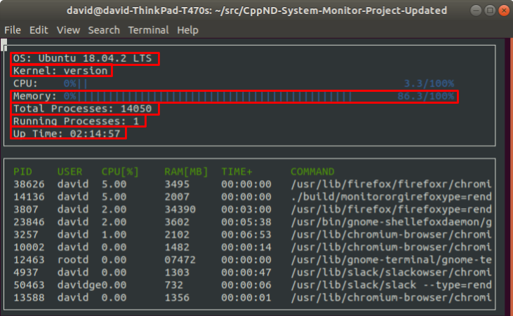
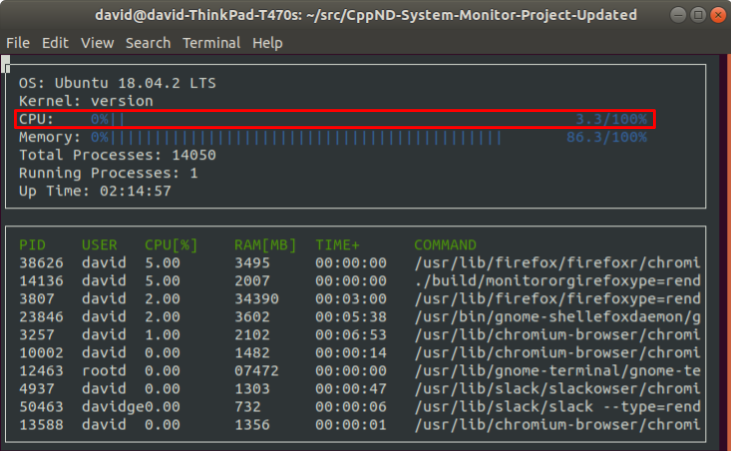
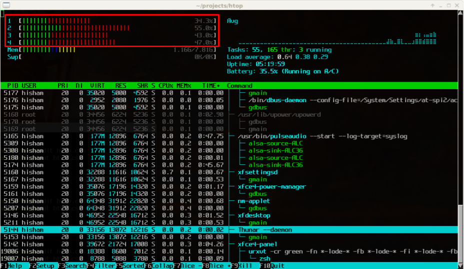
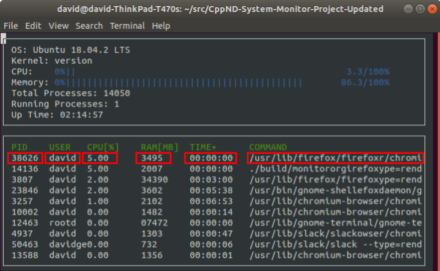
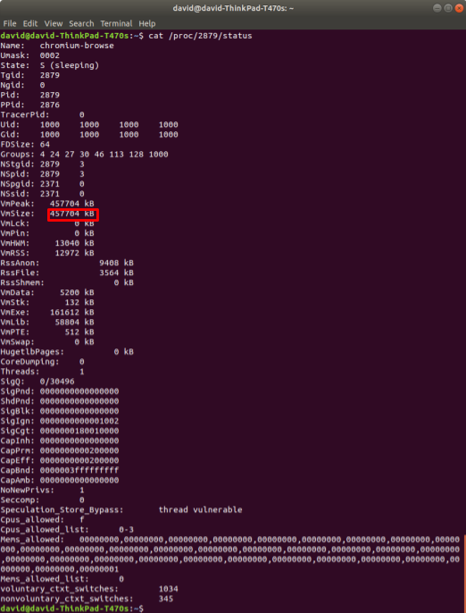

# Table of Contents
1. [System Data](#system-data)
2. [Processor Data](#processor-data)
3. [Process Data](#process-data)
4. [Goal](#goal)

# System Data

Linux stores a lot of system data in files within the `/proc` directory. Most of the data that this project requires exists in those files.

## Operating System

Information about the operating system exists outside of the `/proc` directory, in the `/etc/os-release` file.

There are several strings from which to choose here, but the most obvious is the value specified by "PRETTY_NAME".

## Kernel

Information about the kernel exists `/proc/version` file.

## Memory Utilization

Information about memory utilization exists in the `/proc/meminfo` file.

There are a [variety](https://www.thegeekdiary.com/understanding-proc-meminfo-file-analyzing-memory-utilization-in-linux/) of [ways](https://access.redhat.com/solutions/406773) to use this data to calculate memory utilization.

[Hisham H. Muhammad](http://hisham.hm/about), the author of [htop](http://hisham.hm/htop/index.php), wrote a [Stack Overflow answer](https://stackoverflow.com/a/41251290) about how htop calculates memory utilization from the data in `/proc/meminfo`.

Use the formula that makes the most sense to you!

## Total Processes

Information about the total number of processes on the system exists in the `/proc/stat` file.

## Running Processes

Information about the number of processes on the system that are currently running exists in the `/proc/stat` file.

## Up Time

Information about system up time exists in the `/proc/uptime` file.

> This file contains two numbers (values in seconds): the uptime of the system (including time spent in suspend) and the amount of time spent in the idle process.

From the [_man_ page for `proc`](http://man7.org/linux/man-pages/man5/proc.5.html)

# Processor Data

Linux stores processor utilization data within the `/proc/stat` file.

This data is more complex than most of the other data necessary to complete this project.

For example, `/proc/stat` contains aggregate processor information (on the "cpu" line) and individual processor information (on the "cpu0", "cpu1", etc. lines). Indeed, [htop](https://hisham.hm/htop/) displays utilization information for each individual processor.

For this project, however, you only need to display aggregate CPU information, which you can find on the "cpu" line of `/proc/stat`.

If you would like to add individual processor information to your system monitor project, go for it!

## Data

`/proc/stat` contains 10 integer values for each processor. The Linux source code [documents each of these numbers](https://github.com/torvalds/linux/blob/master/Documentation/filesystems/proc.txt):

> The very first "cpu" line aggregates the numbers in all of the other "cpuN" lines. These numbers identify the amount of time the CPU has spent performing different kinds of work. Time units are in USER_HZ (typically hundredths of a second). The meanings of the columns are as follows, from left to right:

- user: normal processes executing in user mode
- nice: niced processes executing in user mode
- system: processes executing in kernel mode
- idle: twiddling thumbs
- iowait: In a word, iowait stands for waiting for I/O to complete. But there are several problems:
    1. Cpu will not wait for I/O to complete, iowait is the time that a task is waiting for I/O to complete. When cpu goes into idle state for outstanding task io, another task will be scheduled on this CPU.
    2. In a multi-core CPU, the task waiting for I/O to complete is not running on any CPU, so the iowait of each CPU is difficult to calculate.
    3. The value of iowait field in /proc/stat will decrease in certain conditions. So, the iowait is not reliable by reading from /proc/stat.
- irq: servicing interrupts
- softirq: servicing softirqs
- steal: involuntary wait
- guest: running a normal guest
- guest_nice: running a niced guest

Even once you know what each of these numbers represents, it's still a challenge to determine exactly how to use these figures to calculate processor utilization. [This guide](https://github.com/Leo-G/Data-Science-Wiki) and [this StackOverflow post](https://stackoverflow.com/questions/23367857/accurate-calculation-of-cpu-usage-given-in-percentage-in-linux) are helpful.

## Measurement Interval

Once you've parsed `/proc/stat` and calculated the processor utilization, you've got what you need for this project. Congratulations!

However, when you run your system monitor, you might notice that the process utilization seems very stable. Too stable.

That's because the processor data in `/proc/stat` is measured since boot. If the system has been up for a long time, a temporary interval of even extreme system utilization is unlikely to change the long-term average statistics very much. This means that the processor could be red-lining _right now_ but the system monitor might still show a relatively underutilized processor, if the processor has spent most of the time since boot in an idle state.

You might want to update the system monitor to report the current utilization of the processor, rather than the long-term average utilization since boot. You would need to measure the difference in system utilization between two points in time relatively close to the present. A formula like:

Δ active time units / Δ total time units

Consider this a bonus challenge that is not required to pass the project.

# Process Data

Linux stores data about individual processes in files within subdirectories of the `/proc` directory. Each subdirectory is named for that particular process's [identifier](https://en.wikipedia.org/wiki/Process_identifier) number. The data that this project requires exists in those files.

## PID

The process identifier (PID) is accessible from the `/proc` directory. Typically, all of the subdirectories of `/proc` that have integral names correspond to processes. Each integral name corresponds to a process ID.

Parsing directory names with C++ is tricky, so we have provided in the project starter code a pre-implemented function to capture the PIDs.

## User

Each process has an associated [user identifier (UID)](https://en.wikipedia.org/wiki/User_identifier), corresponding to the process owner. This means that determining the process owner requires two steps:

1. Find the UID associated with the process
2. Find the user corresponding to that UID

The UID for a process is stored in `/proc/[PID]/status`.

![`cat /proc/[PID]/status`](images/system-monitor-process-uid.png)

The [_man_ page for `proc`](http://man7.org/linux/man-pages/man5/proc.5.html) contains a "/proc/[pid]/status" section that describes this file.

For the purposes of this project, you simply need to capture the first integer on the "Uid:" line.

### Username

[`/etc/passwd`](http://man7.org/linux/man-pages/man5/passwd.5.html) contains the information necessary to match the UID to a username.

## Processor Utilization

Linux stores the CPU utilization of a process in the `/proc/[PID]/stat` file.

![`cat /proc/[PID]/stat`](images/system-monitor-process-utilization.png)

Much like the calculation of aggregate processor utilization, half the battle is extracting the relevant data from the file, and the other half of the battle is figuring out how to use those numbers to calculate processor utilization.

The "/proc/[pid]/stat" section of the [`proc` _man_ page](http://man7.org/linux/man-pages/man5/proc.5.html) describes the meaning of the values in this file. [This StackOverflow answer](https://stackoverflow.com/a/16736599) explains how to use this data to calculate the process's utilization.

As with the calculation of aggregate processor utilization, it is sufficient for this project to calculate the average utilization of each process since the process launched. If you would like to extend your project to calculate a more current measurement of process utilization, we encourage you to do that!

## Memory Utilization

Linux stores memory utilization for the process in `/proc/[pid]/status`.

In order to facilitate display, consider [converting the memory utilization into megabytes](https://www.google.com/search?q=convert+from+kb+to+mb&oq=convert+from+kb+to+mb).

## Up Time

Linux stores the process up time in `/proc/[pid]/stat`.

![`cat /proc/[pid]/stat`](images/system-monitor-process-up-time.png)

The "/proc/[pid]/stat" section of the [`proc` _man_ page](http://man7.org/linux/man-pages/man5/proc.5.html) describes each of the values in this file.

> (22) starttime %llu
> 
> The time the process started after system boot. In kernels before Linux 2.6, this value was expressed in jiffies. Since Linux 2.6, the value is expressed in clock ticks (divide by sysconf(_SC_CLK_TCK)).

Note that the "starttime" value in this file is measured in "clock ticks". In order to convert from "clock ticks" to seconds, you must:

- #include [<unistd.h>](http://pubs.opengroup.org/onlinepubs/9699919799/basedefs/unistd.h.html)
- divide the "clock ticks" value by `sysconf(_SC_CLK_TCK)`

Once you have converted the time value to seconds, you can use the `Format::Time()` function from the project starter code to display the seconds in a "HH:MM:SS" format.

## Command

Linux stores the command used to launch the function in the `/proc/[pid]/cmdline` file.

![`cat /proc/[pid]/cmdline`](images/system-monitor-process-command.png)

# Goal

It should look like [this](https://youtu.be/xw6_Mz3O54Y) when the project is complete.