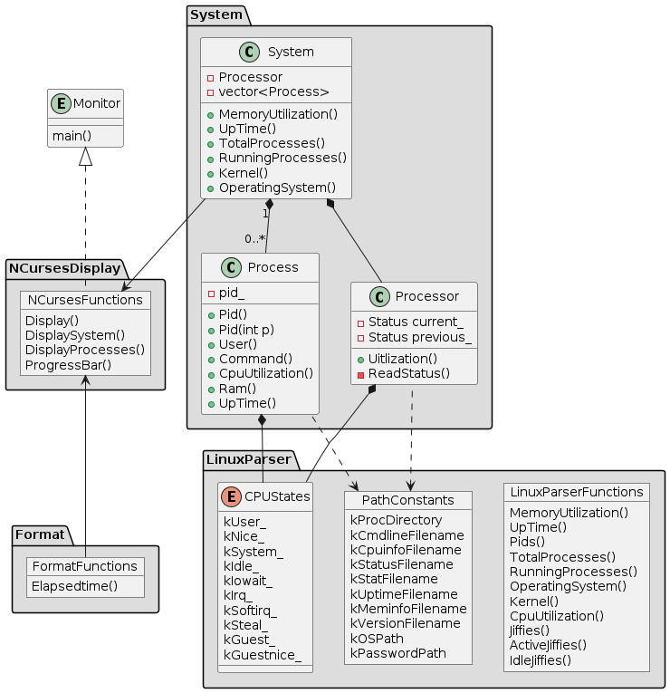

# Class Diagram

# Linux System

These are notes about developing this project and the Linux system.

# Operating System

Information about the operating system exists outside of the /proc directory, in the /etc/os-release file.

`cat /etc/os-release`
There are several strings from which to choose here, but the most obvious is the value specified by "PRETTY_NAME".

# Kernel

Information about the kernel exists /proc/version file.

`cat /proc/version`

# Memory Utilization

Information about memory utilization exists in the /proc/meminfo file.

`cat /proc/meminfo`
There are a variety of ways to use this data to calculate memory utilization.

Hisham H. Muhammad, the author of htop, wrote a [Stack Overflow answer](https://stackoverflow.com/a/41251290) about how htop calculates memory utilization from the data in /proc/meminfo.

Use the formula that makes the most sense to you!

# Total Processes

Information about the total number of processes on the system exists in the /proc/meminfo file.

`cat /proc/stat`
Running Processes
Information about the number of processes on the system that are currently running exists in the /proc/meminfo file. 

`cat /proc/stat`
Up Time
Information about system up time exists in the /proc/uptime file.

`cat /proc/uptime`

[proc manpage](https://man7.org/linux/man-pages/man5/proc.5.html)

# Processor

Processor Data

Linux stores processor utilization data within the /proc/stat file.

`cat /proc/stat`
This data is more complex than most of the other data necessary to complete this project.

For example, /proc/stat contains aggregate processor information (on the "cpu" line) and individual processor information (on the "cpu0", "cpu1", etc. lines). Indeed, htop displays utilization information for each individual processor.

# Measurement Interval

Once you've parsed /proc/stat and calculated the processor utilization, you've got what you need for this project. Congratulations!

However, when you run your system monitor, you might notice that the process utilization seems very stable. Too stable.

That's because the processor data in /proc/stat is measured since boot. If the system has been up for a long time, a temporary interval of even extreme system utilization is unlikely to change the long-term average statistics very much. This means that the processor could be red-lining right now but the system monitor might still show a relatively underutilized processor, if the processor has spent most of the time since boot in an idle state.

You might want to update the system monitor to report the current utilization of the processor, rather than the long-term average utilization since boot. You would need to measure the difference in system utilization between two points in time relatively close to the present. A formula like:

Δ active time units / Δ total time units

Consider this a bonus challenge that is not required to pass the project.

# Process Data

Linux stores data about individual processes in files within subdirectories of the /proc directory. Each subdirectory is named for that particular process's identifier number. The data that this project requires exists in those files.

# PID

The process identifier (PID) is accessible from the /proc directory. Typically, all of the subdirectories of /proc that have integral names correspond to processes. Each integral name corresponds to a process ID.

`ls /proc`
Parsing directory names with C++ is tricky, so we have provided in the project starter code a pre-implemented function to capture the PIDs.

# User

Each process has an associated user identifier (UID), corresponding to the process owner. This means that determining the process owner requires two steps:

Find the UID associated with the process
Find the user corresponding to that UID
The UID for a process is stored in /proc/[PID]/status.

`cat /proc/[PID]/status`
The man page for proc contains a "/proc/[pid]/status" section that describes this file.

For the purposes of this project, you simply need to capture the first integer on the "Uid:" line.

# Username

/etc/passwd contains the information necessary to match the UID to a username.

`cat /etc/passwd`

# Processor Utilization

Linux stores the CPU utilization of a process in the /proc/[PID]/stat file.

`cat /proc/[PID]/stat`
Much like the calculation of aggregate processor utilization, half the battle is extracting the relevant data from the file, and the other half of the battle is figuring out how to use those numbers to calculate processor utilization.

The "/proc/[pid]/stat" section of the proc man page describes the meaning of the values in this file. This StackOverflow answer explains how to use this data to calculate the process's utilization.

As with the calculation of aggregate processor utilization, it is sufficient for this project to calculate the average utilization of each process since the process launched. If you would like to extend your project to calculate a more current measurement of process utilization, we encourage you to do that!

# Memory Utilization

Linux stores memory utilization for the process in /proc/[pid]/status.

In order to facilitate display, consider converting the memory utilization into megabytes.

# Up Time

Linux stores the process up time in /proc/[pid]/stat.

`cat /proc/[pid]/stat`
The "/proc/[pid]/stat" section of the proc man page describes each of the values in this file.

(22) starttime %llu

The time the process started after system boot. In kernels before Linux 2.6, this value was expressed in jiffies. Since Linux 2.6, the value is expressed in clock ticks (divide by sysconf(_SC_CLK_TCK)).

Note that the "starttime" value in this file is measured in "clock ticks". In order to convert from "clock ticks" to seconds, you must:

#include <unistd.h>
divide the "clock ticks" value by sysconf(_SC_CLK_TCK)
Once you have converted the time value to seconds, you can use the Format::Time() function from the project starter code to display the seconds in a "HH:MM:SS" format.

# Command

Linux stores the command used to launch the function in the /proc/[pid]/cmdline file.
